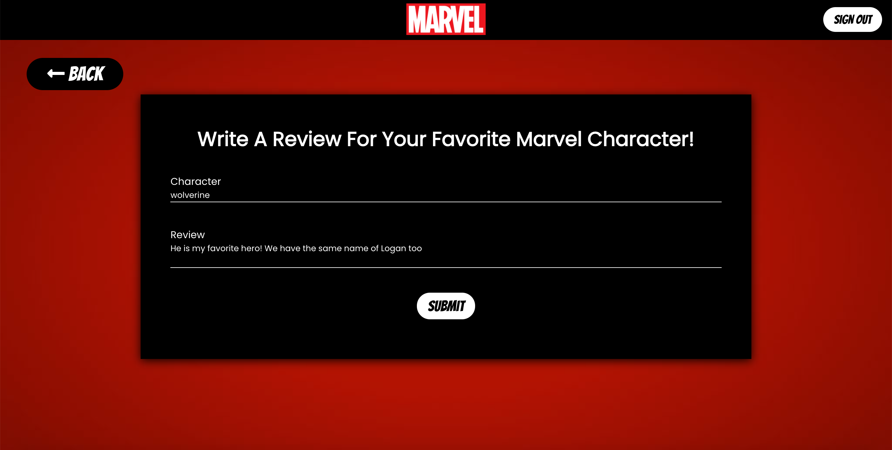

# My Marvel Review

### Links:
Demo - [www.mymarvelreview.com](www.mymarvelreview.com)
Repo - [https://github.com/loganveik/marvelReact/tree/master/marvel_react](https://github.com/loganveik/marvelReact/tree/master/marvel_react)

### Description:
This app, once signed in, lets the user write and view their own reviews about any Marvel character. The user can also search any character or comicbook from the Marvel API.

### Technologies Used:
React, Firebase(auth/firestore), CSS, Javascript, Axios, Node, Express, Marvel API

### How to Use:
1) Login/Sign Up Page

2) Profile Page

3) Character Search Page

4) Comics Search Page

5) Write Review Page

6) My Reviews Page
